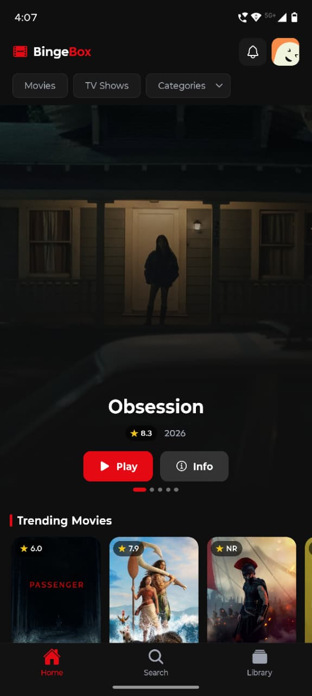
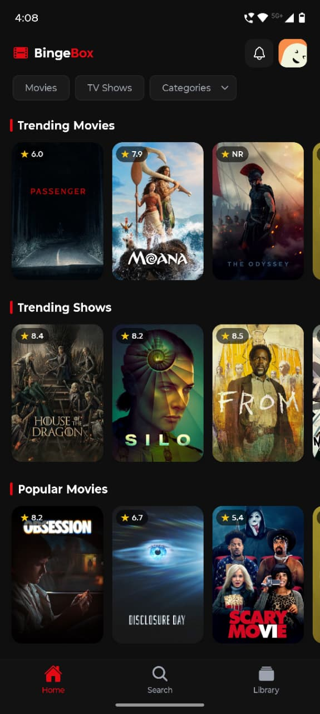
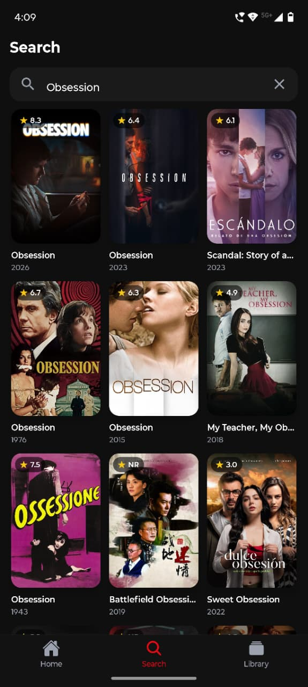
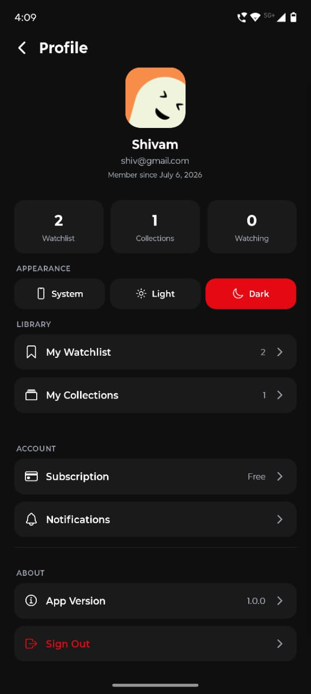
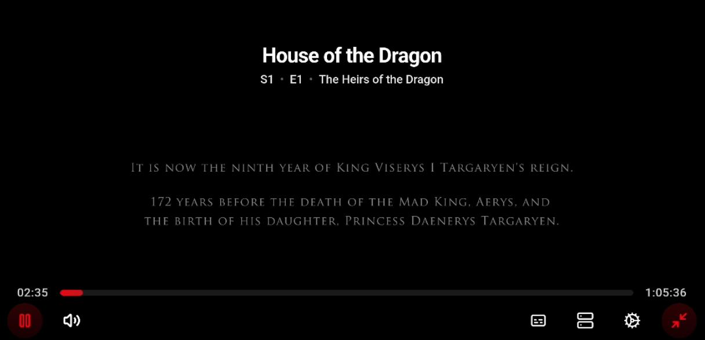

<div align="center">

# BingeBox

**A feature-rich movie & TV streaming companion app**


Browse trending movies & TV shows, search across TMDB's catalog, manage watchlists and collections, track playback progress, and stream content — all wrapped in a cinematic dark-themed UI with smooth animations.

[Download APK](#build--deployment) · [Watch Demo](#demo-video) · [View Repository](#build--deployment)

</div>

---

## Screenshots

<table>
  <tr>
    <td align="center"><b>Home - Hero Banner</b></td>
    <td align="center"><b>Home - Browse</b></td>
    <td align="center"><b>Search</b></td>
  </tr>
  <tr>
    <td></td>
    <td></td>
    <td></td>
  </tr>
  <tr>
    <td align="center"><b>Profile</b></td>
    <td align="center" colspan="2"><b>Video Player</b></td>
  </tr>
  <tr>
    <td></td>
    <td colspan="2"></td>
  </tr>
</table>

> More screenshots: Movie Details, Watchlist, Collections, Subscription, Notifications, Light Mode — coming soon.

---

## Demo Video

> [Watch the demo video](YOUR_DEMO_VIDEO_LINK_HERE)

---

## Features

### Content Browsing
- Auto-scrolling hero banner with trending content
- Filter by Movies, TV Shows, or Genre categories
- Sections: Trending, Popular, Top Rated, Upcoming, On the Air
- Genre-based discovery with animated dropdown

### Search
- Real-time search with 400ms debounce
- Infinite scroll pagination
- Fuzzy fallback matching (Levenshtein distance)
- Trending recommendations when idle

### Movie & TV Details
- Parallax hero backdrop with sticky header
- Rating badge, genre pills, runtime, release year
- Cast carousel (top 15 with profile images)
- "More Like This" recommendations
- TV: Season picker with episode list and still images

### Playback
- WebView-based video player with auto-play
- Resume from saved position
- Per-episode progress tracking for TV shows
- Continue Watching row on Home screen

### Watchlist & Collections
- Bookmark movies/TV shows with animated toggle
- Custom collections: create, rename, delete
- Add/remove items across collections
- 3-column poster grid with remove support

### Authentication & Subscription
- Email/password auth via Supabase
- 24-hour session expiry enforcement
- 3-tier Razorpay subscription (Monthly ₹149 / Quarterly ₹399 / Yearly ₹1,299)
- Free tier limit (3 plays) with paywall enforcement

### Push Notifications
- OneSignal integration (Android)
- In-app notification inbox with unread indicators
- Welcome notification on first login

### Theming & Animations
- System / Light / Dark mode with persistent preference
- Animated splash screen (scale + rotate + fade)
- Spring animations on bookmark & card press
- Skeleton loading states with pulse animation
- Notification bell shake on new alerts

---

## Tech Stack

| Category | Technology |
|----------|-----------|
| Framework | React Native 0.85, Expo SDK 56 |
| Language | TypeScript 6.0 |
| Navigation | Expo Router (file-based, typed routes) |
| Styling | NativeWind (Tailwind CSS) + React Native Paper |
| State Management | Zustand (persisted with AsyncStorage) |
| Server State | TanStack React Query |
| Animations | React Native Reanimated |
| Backend | Supabase (Auth, Database, Edge Functions) |
| API | TMDB v3 |
| Payments | Razorpay |
| Push Notifications | OneSignal |
| Storage | AsyncStorage |
| Testing | Jest + React Native Testing Library |

---

## Architecture

### Folder Structure

```
src/
├── app/                 # Screens (Expo Router file-based routing)
│   ├── (tabs)/          # Tab navigation (Home, Search, Library)
│   ├── movie/[id].tsx   # Dynamic movie detail
│   ├── tv/[id].tsx      # Dynamic TV detail
│   └── player/[id].tsx  # Video player (modal)
├── components/          # 26 reusable UI components
├── hooks/               # 14 custom hooks (data fetching, theme, guards)
├── stores/              # 7 Zustand stores (auth, watchlist, collections, etc.)
├── api/                 # TMDB client + Supabase remote sync layer
├── queries/             # React Query key factories
├── lib/                 # Utilities (format, fuzzy search, avatar, etc.)
└── constants/           # Theme colors, strings, subscription plans
```

### Navigation

Expo Router with file-based routing. Three bottom tabs (Home, Search, Library) with stack screens for details, player, auth, account, paywall, and notifications.

### State Management

- **Zustand** (7 stores) — auth, watchlist, continue watching, collections, notifications, theme, free tier tracking. All persisted via AsyncStorage with remote Supabase sync.
- **React Query** — server state caching, infinite queries for search, subscription polling.

### API Layer

- `tmdbGet<T>()` — generic typed TMDB client with Bearer auth
- Remote sync modules for watchlist, collections, continue watching, and subscriptions via Supabase
- Mock API support for development/testing

### Component Structure

Presentational components memoized with `React.memo()`. Business logic lives in custom hooks. Stores handle persistence and sync.

---

## Performance Optimizations

| Optimization | Implementation |
|-------------|---------------|
| `React.memo()` | Applied to MovieCard, HeroCard, CastList, GenrePills, EpisodeList, and more |
| `useMemo` / `useCallback` | Derived data and render functions across all screens |
| TanStack Query caching | Query key factories with automatic cache invalidation |
| Debounced search | 400ms delay before API calls |
| Infinite scrolling | Paginated search with `getNextPageParam` |
| Optimized FlatList | `initialNumToRender`, `maxToRenderPerBatch`, `windowSize`, `getItemLayout` |
| AsyncStorage persistence | Offline-first stores with background sync |
| Batched API requests | `append_to_response=credits,similar` reduces network calls |
| React Compiler | Enabled for automatic optimization |

---

## Setup & Installation

### Prerequisites

- Node.js 20+ (project uses Node 22 via `.nvmrc`)
- npm
- Expo CLI
- Android Studio / Xcode (for native builds)

### Installation

```bash
# 1. Clone the repository
git clone YOUR_GITHUB_REPO_URL
cd BingeBox

# 2. Use correct Node version
nvm use

# 3. Install dependencies
npm install

# 4. Set up environment variables (see below)
cp .env.example .env

# 5. Start the development server
npm run android    # or: npm run ios / npm run web
```

> After changing `.env`, restart with cache cleared: `npx expo start -c`

---

## Environment Variables

Create a `.env` file in the project root:

```env
# TMDB API (required) — get a v4 Read Access Token at https://themoviedb.org/settings/api
EXPO_PUBLIC_TMDB_ACCESS_TOKEN=your_tmdb_v4_read_access_token

# Supabase (required for auth, sync, subscriptions)
EXPO_PUBLIC_SUPABASE_URL=your_supabase_url
EXPO_PUBLIC_SUPABASE_ANON_KEY=your_supabase_anon_key

# Razorpay (optional — enables subscription paywall)
EXPO_PUBLIC_RAZORPAY_KEY_ID=your_razorpay_key_id

# OneSignal (optional — enables push notifications on Android)
EXPO_PUBLIC_ONESIGNAL_APP_ID=your_onesignal_app_id

# OMDB (optional)
EXPO_PUBLIC_OMDB_API_KEY=your_omdb_api_key
```

### TMDB blocked in your region?

Some ISPs block TMDB domains. Quick fixes:
- Switch device DNS to `1.1.1.1` or `8.8.8.8`, or use a VPN
- Deploy the included `tmdb-proxy-worker.js` as a Cloudflare Worker, then set:
  ```env
  EXPO_PUBLIC_TMDB_API_BASE=https://your-worker.workers.dev/3
  EXPO_PUBLIC_TMDB_IMAGE_BASE=https://your-worker.workers.dev/t/p
  ```

---

## Testing

```bash
# Run linter
npm run lint

# Type checking
npx tsc --noEmit

# Run unit tests
npm test
```

All tests are passing across stores, components, and utility modules.

---

## Build & Deployment

| Resource | Link |
|----------|------|
| APK Download | [Download APK](YOUR_APK_DOWNLOAD_LINK) |
| GitHub Repository | [View Source](YOUR_GITHUB_REPO_URL) |
| Demo Video | [Watch Demo](YOUR_DEMO_VIDEO_LINK) |
| Expo Project | [View on Expo](https://expo.dev/accounts/shivam330/projects/Bingebox) |

### Build Commands

```bash
# Preview APK (Android)
eas build --profile preview --platform android

# Production build
eas build --profile production --platform android
```

---

## Assignment Checklist

- [x] Home screen with trending/popular content and hero banner
- [x] Search with real-time results and pagination
- [x] Movie & TV detail screens with cast, genres, and recommendations
- [x] Video playback with resume support
- [x] Watchlist with add/remove functionality
- [x] Custom collections (create, rename, delete, add/remove items)
- [x] Continue Watching with progress tracking
- [x] Authentication (sign in / sign up)
- [x] Subscription plans with payment integration (Razorpay)
- [x] Push notifications (OneSignal)
- [x] Dark / Light / System theme support
- [x] Animations (Reanimated — parallax, spring, skeleton, splash)
- [x] State management (Zustand + React Query)
- [x] Local persistence (AsyncStorage) + remote sync (Supabase)
- [x] TypeScript with strict typing and typed routes
- [x] Performance optimizations (memo, debounce, FlatList tuning)
- [x] Unit tests (Jest + React Native Testing Library)
- [x] Clean architecture with reusable components and custom hooks

---

<div align="center">

Built with React Native & Expo

</div>
